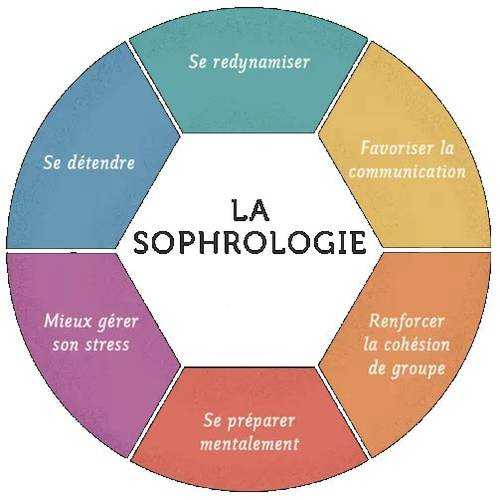

<!DOCTYPE html>
<html lang="fr">
<head>
    <meta charset="UTF-8">
    <meta name="viewport" content="width=device-width, initial-scale=1.0">
    <title>Isabelle Tessier - Sophrologue, Psychotherapie</title>
    
</head>
<body>
    <header>
        Isabelle Tessier - Sophrologue, Psychotherapie
    </header>
    <nav>
        <a href="#accueil">Accueil</a>
        <a href="#services">Mes Services</a>
        <a href="#avis">Avis</a>
        <a href="#contact">Contact</a>
        <a href="#rdv">Prendre RDV</a>
    </nav>
    

        <h1>Bienvenue dans un espace de bien-etre et d'ecoute</h1>
        
Sophrologue certifiee, et je vous invite à un voyage vers un mieux-etre physique et mental. A travers des techniques de sophrologie, de relaxation, de respiration et de visualisation, je vous aide à liberer les tensions et a retrouver une harmonie interieure.
Afin de mieux gerer votre stress et vos emotions, ameliorer votre sommeil, renforcer votre confiance en vous, vous préparer à des eevenements stressants (examens, competitions, prise de parole…) ou simplement vous offrir un moment d’apaisement et de relaxation, la sophrologie est une methode douce et accessible à tous.
Au cours de seances, j'accompagne avec bienveillance dans un cadre propice à l’éceoute, au lâcaher-prise et à la transformation positive. J’accueille tout public avec soin et attention, pour vous aider a (re)trouver harmonie et serenite dans votre quotidien.
N’hesitez pas à me contacter pour en savoir plus ou reserver une seance !

Envie d’en savoir plus ou de réserver une séance ? Contactez-moi dès maintenant !.

        
    

    

        <h2>Mes Services</h2>
        <ul>
            <li>Accompagnement energetique individuel (psychotherapie)</li>
            <li>Relaxation et sophrologie</li>
            <li>Gestion des emotions et du stress</li>
            <li>Preparation aux examens</li>
            <li>Preparation à l’accouchement</li>
            <li>Troubles du sommeil</li>
        </ul>
    

    

        <h2>Vos Avis</h2>
        
Decouvrez les temoignages de mes clients sur Google.

    

    

        <h2>Me Contacter</h2>
        
Adresse : 21, rue des chapeliers 09000 Foix

        
Telephone : 0620442734

    

    

        <h2>Prendre Rendez-Vous</h2>
        
Contactez-moi par telephone.

    

    <footer>
        &copy; 2025 Isabelle Tessier - Sophrologue, Psychotherapie - Tous droits reserves
    </footer>
</body>
</html>
